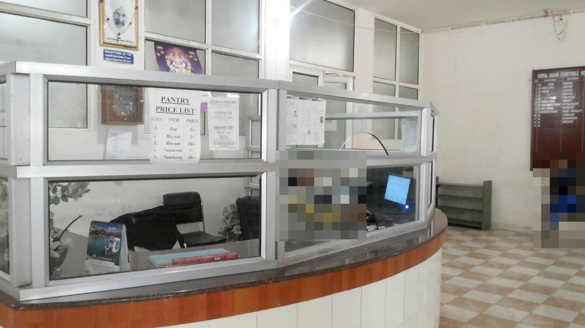
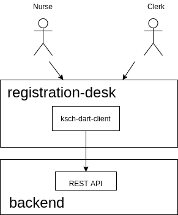

# Registration Desk

This repository contains the source code for the app to be used at the registration desk of the [Kirpal Sagar Charitable Hospital](https://kirpal-sagar.org/en/kirpal-charitable-hospital-en/).



## Context

The Registration Desk is used by nurses and clerks.
The tasks they need to do there are around the patient registration and billing.



The app depends upon the [Backend](https://github.com/ksch-workflows/backend) for the reading and writing of its data.
For this purpose, it is accessing the [REST API](https://www.redhat.com/en/topics/api/what-is-a-rest-api) of the backend.

## Architecture

The following section gives an overview of the code in this repository.
For the big picture view, please refer to the [K.S.C.H. Workflows architecture documentation](https://ksch-workflows.github.io/arc42/).

### Technology

The Registration Desk app is a single-page web application, powered by [Flutter Web](https://flutter.dev/web).

### Code structure

The code is structured by the default 

- `/doc`: Miscellaneous files for the project documentation.
- `/lib`: Main home of the application's source code.
  - `/api`: Provides services and data structures for the access of the REST API of the app's backend.
  - `/l10n`: Files required for the localization of the app. 
  - `/pages`: Every page of the web app gets a directory here.
  - `/util`: Non-UI related tools which may be accessed from all other parts of the app.
  - `/widgets`: UI components which may be access from all pages of the app.
- `/test`: The code in the `/test` directory reflect the structure of the `/lib` directory.
- `/web`: HTML scaffold for the generated web page.

### Design principles

> Clean code always looks like it was written by someone who cares. There is nothing obvious you can do to make it better. - [Michael Feathers](https://cvuorinen.net/2014/04/what-is-clean-code-and-why-should-you-care/)

- TDD: Enable a stable code base which supports regular refactoring by test-driven development.
- SOLID: Keep the code base clear to understand by the application of the SOLID design principles.

## Development

### Getting started

```
git clone git@github.com:ksch-workflows/registration-desk.git \
  -o upstream \
  registration_desk
```

### Start the backend

```
cd ../backend
./gradlew bootRun
```

### Start the app

For local development, the Registration Desk app can be started like this:

```
flutter run -d chrome
```

## Deployment

### Testing

For demos and quality assurance, the Registration Desk app is deployed on GitHub Pages:

https://ksch-workflows.github.io/registration-desk

This gets automatically updated with every change on the repository with the help of [GitHub Actions](https://dev.to/janux_de/automatically-publish-a-flutter-web-app-on-github-pages-3m1f).

### Production

There is no production deployment, yet.
It is planned that the Registration Desk web app is packaged together with a web server in a [Docker image](https://searchitoperations.techtarget.com/definition/Docker-image) so that it can be started with [Docker Compose](https://docs.docker.com/compose/).

## License

K.S.C.H. Workflows is maintained by [KS-plus e.V.](https://ks-plus.org/en/welcome/),
a non-profit association dedicated to supporting the [Kirpal Sagar](https://kirpal-sagar.org/en/welcome/) project.

It is licensed under the [Apache License Version 2.0](https://github.com/ksch-workflows/ksch-workflows/blob/master/LICENSE).
